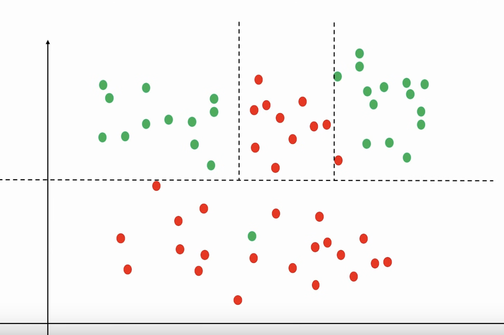

# Regresión Logística

## ✍️ ¿Qué és?
> Aprendizaje supervisado, clasificación binaria (dos clases)
> - Clasificación binaria: 0 o 1, positivo o negativo, verdadero o falso, etc.

 

## 📖 Funcionamiento